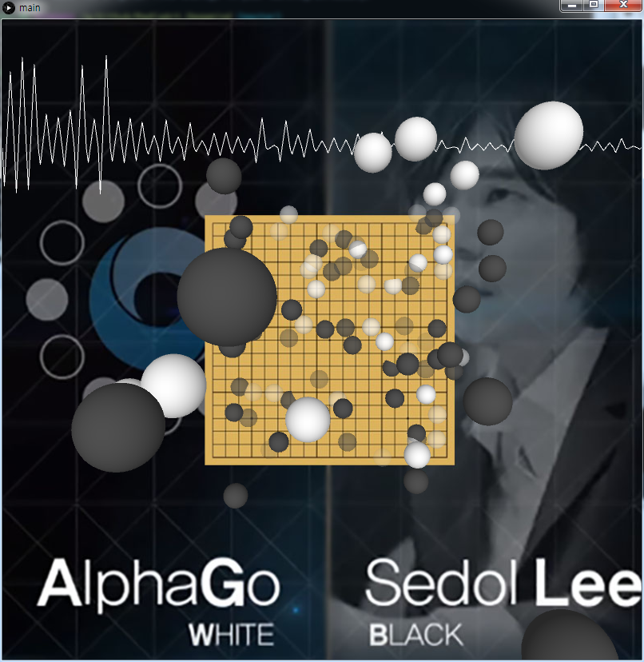
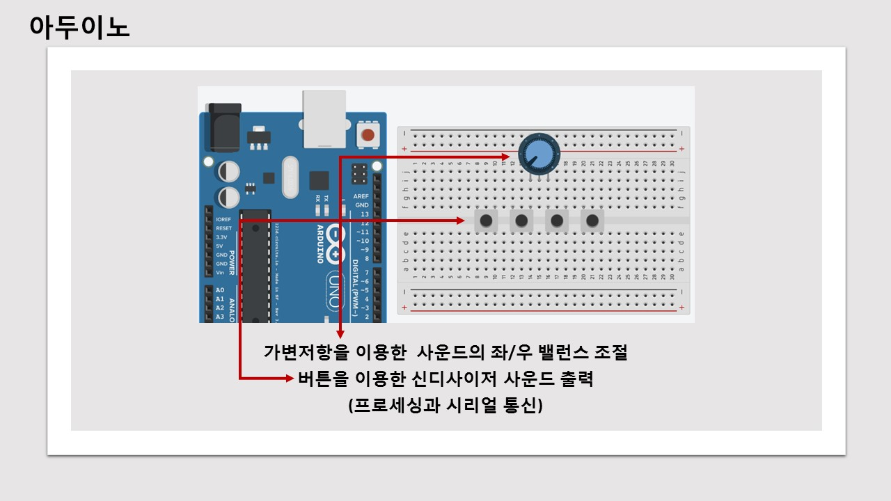

# MediaArt_Deepmind
- 2017-03 ~ 2017-06
- 3학년 1학기 디지털사운디디자인 term 프로젝트
- 1인 개발
- C, Processing, Arduino UNO, LMMS(사운드편집)
- 미디어아트 (제목 : Deepmind Challenge), 주제 : Google Challenge Match AlphaGo vs Lee Se dol

프로세싱을 이용한 시각화

아두이노 상세
